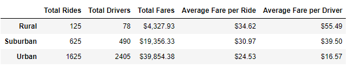

# An Analysis on a Python-based ridesharing app company, Pyber.

## Overview of Project
This project uses 2 datasets given to showcase the relationship between the type of city and the number of drivers and riders, as well as the percentage of total fares, rides, and drivers by type of city.

### Purpose
The purpose of this report is to analyse the data and produce vizualizations to help Pyber improve access to ridesharing services and determine affordability for underserved neighbourhoods.

## Results
Using matplotlib, pandas and other libraries, I was able to produce this Dataframe/table to show different key metrics from each city types:

Some findings based on the above table:
* Urban cities have the highest number of rides taken, resulting in the highest revenue in terms of total number of fares. Urban cities are known for their high population density, so it only makes sense that it has the highest number of rides.
* Urban cities also have the highest number of drivers, most likely because of the high demand of rides in this type of city.
* Destinations tend to be closer and distance away in urban cities than in rural cities, thus the lowest average fare per ride in urban cities.
* Rural cities have the least number of rides, but the average fare per ride is almost $10 more than the average for urban cities.
* Suburban cities have ~6x more drivers than in rural cities, and about 4.5x more revenue.

## Summary
Based on my findings, I would suggest the following:
1. Find ways to increase the number of drivers (incentives? goals?) in suburban and rural cities so this will help lower the average fare per ride.
2. Urban cities have such a higher number of drivers compared to both suburban and rural. Having to repartition some drivers to those city types will help improve access to more ridesharing services.
